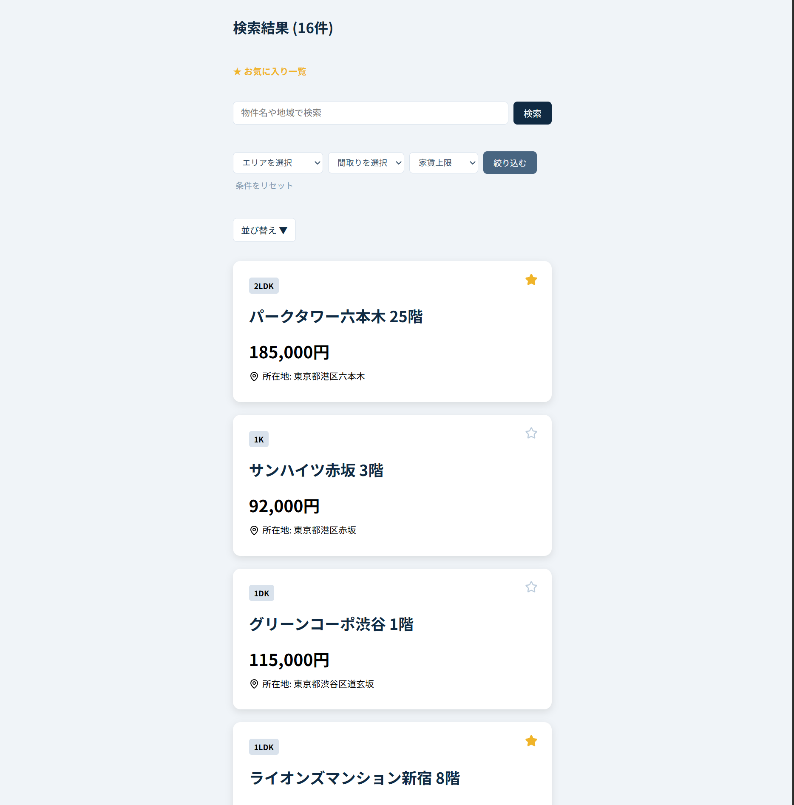
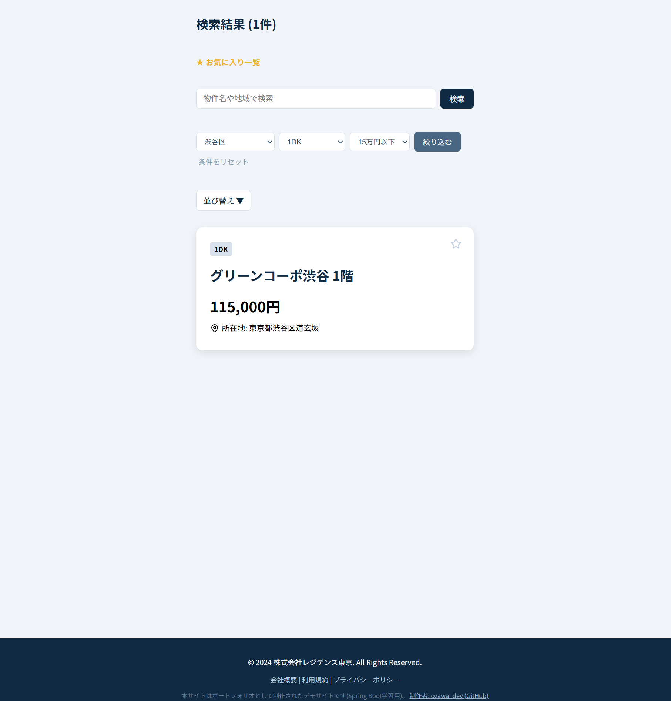
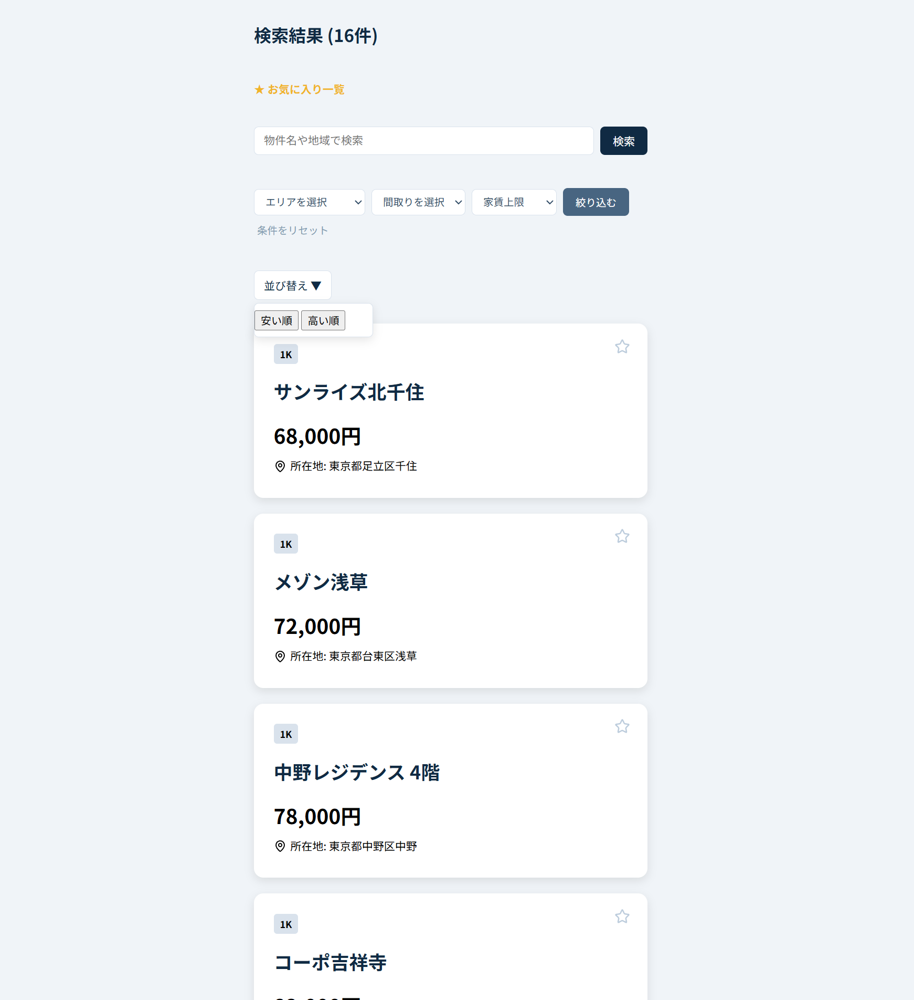
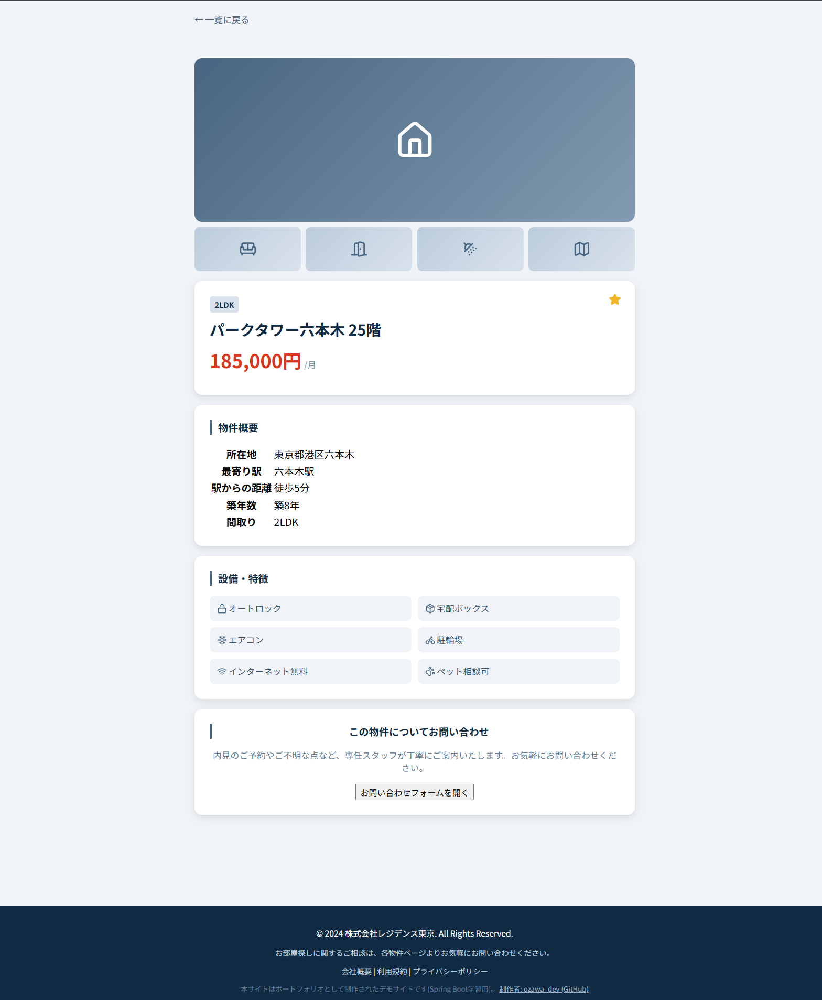
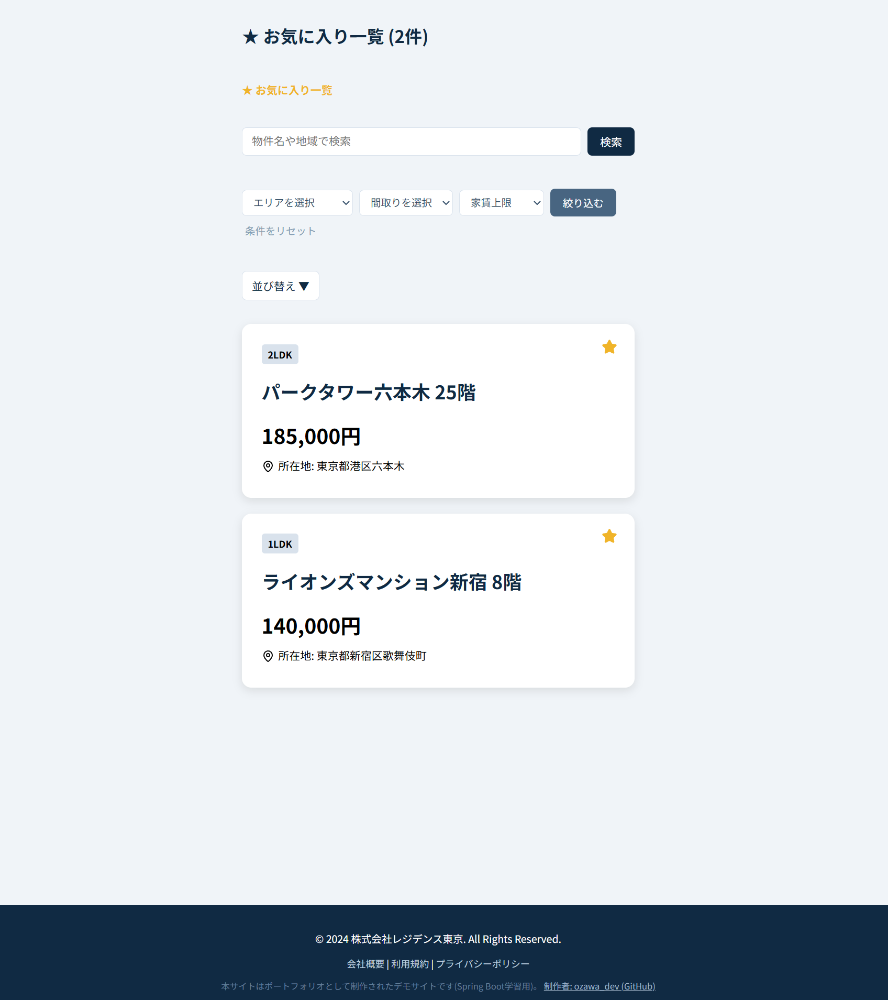
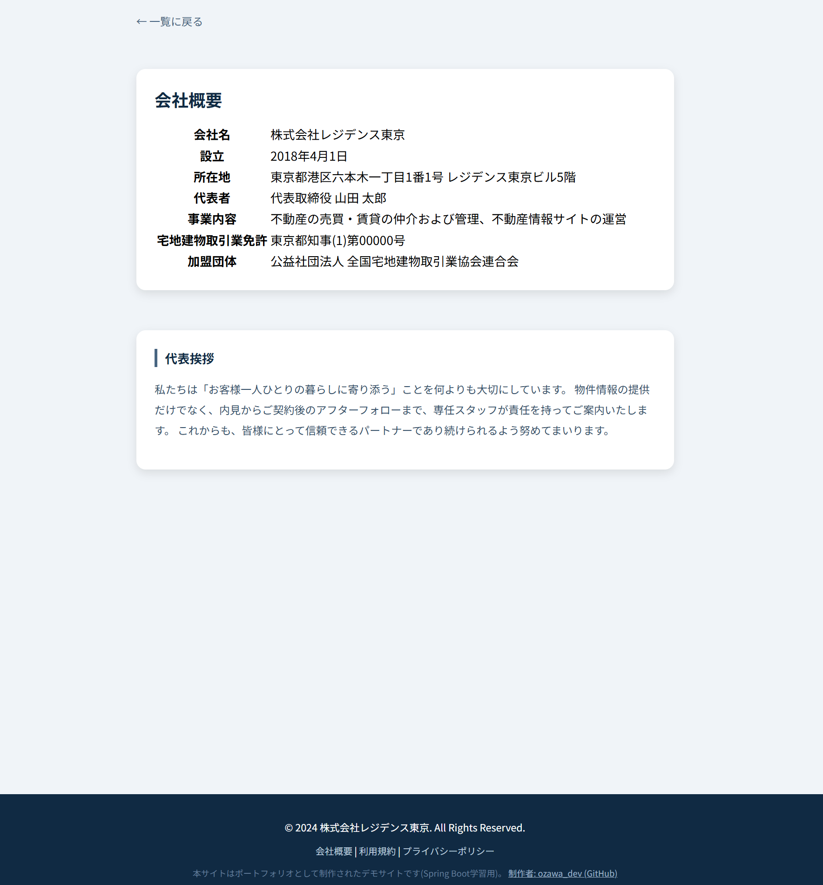
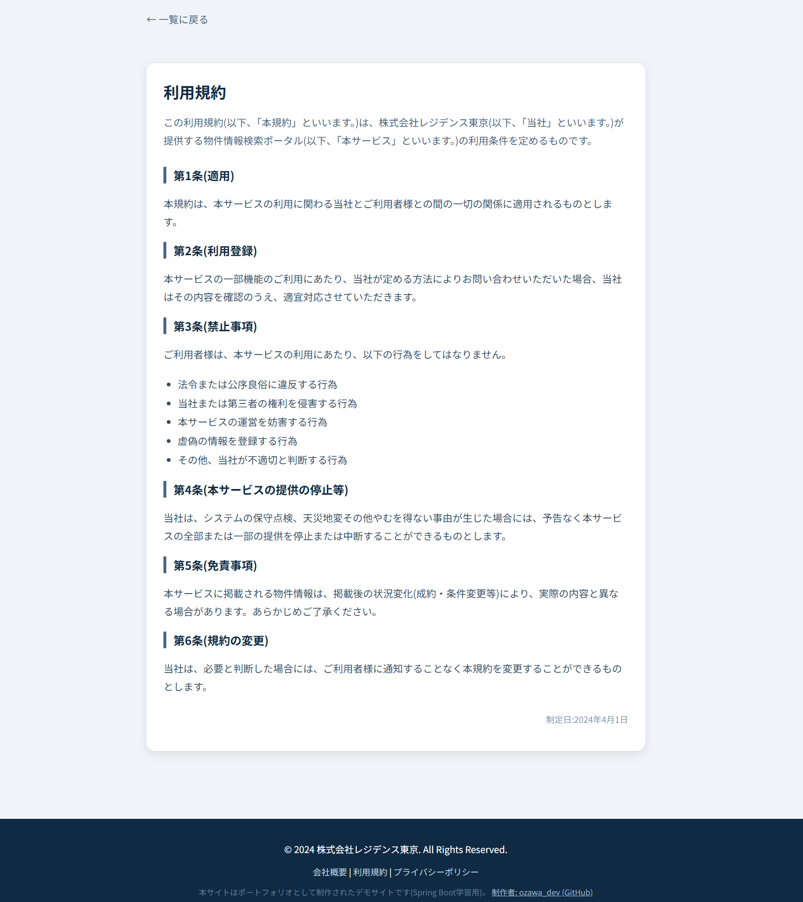
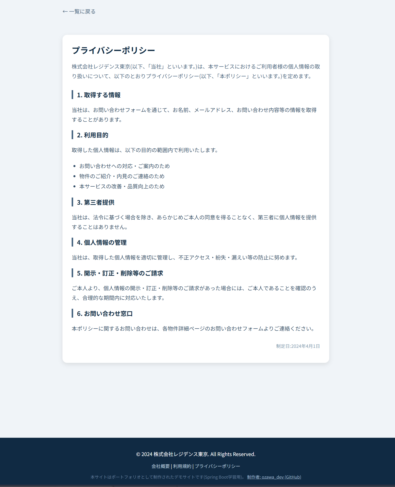

# 物件検索ポータル (Property Search Portal)

Spring Boot + Thymeleaf で構築した、賃貸物件検索ポータルアプリです。
検索・絞り込み・お気に入り機能に加え、会社概要や利用規約といった周辺ページまで含めて、
実在の不動産ポータルサイトに近い構成を意識して実装しています。

**デモサイト**: https://property-search-portal.onrender.com/property

## 主な機能

### サーバーサイド (Spring Boot / Thymeleaf)
- 物件一覧の動的表示(`th:each` によるループ処理)
- キーワード検索(物件名・所在地の部分一致)
- エリア・間取り・家賃上限による複合フィルタ
- 価格ソート(安い順・高い順)
- 物件詳細ページ(`@PathVariable` によるルーティング、`/property/{id}`)
- 会社概要・利用規約・プライバシーポリシーページ

### クライアントサイド (JavaScript / CSS)
- お気に入り機能(`localStorage` を使った状態の永続化)
- お気に入り一覧フィルタ(URLパラメータと連動した絞り込み表示)
- 並び替えアニメーション(FLIP法によるスムーズなカード移動)
- モーダルでのお問い合わせフォーム(入力バリデーション付き)
- レスポンシブ対応(メディアクエリによるスマホ表示最適化)
- Lucideアイコンによる統一されたUI

## 使用技術

| 分類 | 技術 |
|---|---|
| 言語 | Java 17 |
| フレームワーク | Spring Boot 3.x (Spring MVC) |
| テンプレートエンジン | Thymeleaf |
| ビルドツール | Gradle |
| ライブラリ | Lombok, Lucide Icons |
| フロントエンド | HTML / CSS / JavaScript (Vanilla) |
| インフラ | Docker, Render |
| IDE | IntelliJ IDEA |

## 画面イメージ

### 物件一覧・検索フィルタ
エリア・間取り・家賃上限で絞り込める検索フィルタと、キーワード検索を備えた一覧画面です。



### 並び替え
安い順・高い順の切り替え時、カードがアニメーションしながら並び替わります。


### 物件詳細
画像ギャラリー・物件概要・設備一覧を備えた、不動産ポータルサイト風の詳細ページです。


### お問い合わせフォーム
物件詳細ページからモーダルで開くお問い合わせフォームです。入力チェックと送信完了画面を実装しています。


### お気に入り一覧
`localStorage` に保存したお気に入り物件のみを絞り込んで表示します。


### 会社概要・利用規約・プライバシーポリシー
実在のサービスを想定し、周辺ページまで作り込んでいます。




## 実装のポイント

- **役割分担の意識**:サーバーサイド(検索・フィルタ・詳細表示のルーティング)とクライアントサイド(お気に入りの状態管理、UIアニメーション、フォームバリデーション)で処理を分担し、それぞれに適した実装方法を選択しています。
- **FLIPアニメーション**:並び替え時のカード移動は、要素の再配置前後の位置差分を利用したFLIP法(First, Last, Invert, Play)で実装し、ページ遷移なしで滑らかな視覚効果を実現しています。
- **Dockerによる本番デプロイ**:マルチステージビルドのDockerfileを作成し、Render上でコンテナとして本番稼働させています。
- **段階的な機能追加**:Hello World表示から始め、静的HTML → Thymeleaf導入 → モデルクラス設計 → 一覧表示 → 検索/ソート → 詳細ページ → クライアントサイド機能 → 本番デプロイ、という順序で段階的に機能を積み上げています。

## 今後の展望

- Spring Data JPA + H2/MySQL によるデータベース接続(現在はインメモリの `ArrayList` でデータを保持)
- 独自ドメインの取得
- 物件画像のアップロード機能

## セットアップ方法

```bash
# リポジトリをクローン
git clone https://github.com/ozkit0103/property-search-portal.git

# プロジェクトディレクトリに移動
cd property-search-portal

# Gradleでビルド・起動
./gradlew bootRun
```

起動後、ブラウザで `http://localhost:8080/property` にアクセスしてください。

---

制作者: ozawa_dev ([GitHub](https://github.com/ozkit0103))
